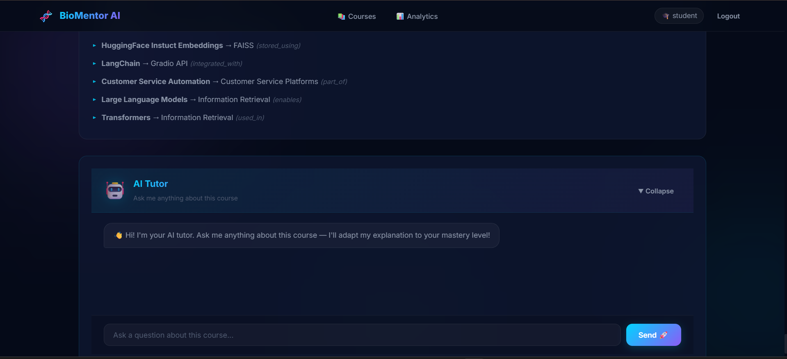

<div align="center">

# 🧬 BioMentor AI
### Dual-Graph Adaptive Biotechnology Learning Platform

An intelligent educational web application tailored for Biotechnology students. BioMentor AI leverages cutting-edge LLMs, RAG techniques, and Knowledge Graphs to provide adaptive learning, real-time mentorship, and comprehensive resource extraction.

</div>

---

## 📸 Platform Overview


## 🧩 Architecture & Workflow

BioMentor AI operates using a sophisticated **Dual-Graph Architecture**. The system seamlessly integrates adaptive document learning via a highly robust LangChain and RAG backend with an easy-to-use frontend.



---

## 🚀 Features

- **Adaptive Learning Paths:** Real-time generation of custom educational pathways suited to the individual's pace.
- **AI-Powered Mentorship:** Ask any Biotechnology-related question and get guided, highly relevant, and contextualized responses.
- **Intelligent RAG & Knowledge Graphs:** Automatically extracts text from uploaded PDFs and cross-references data dynamically to create a semantic understanding of documents.
- **Dual-Graph Visualization:** Map topics dynamically for better comprehension of complex Biological relations.

---

## 🛠️ Tech Stack

### Frontend Applications
- **HTML5 & CSS3:** For a natively fast, responsive, and dynamic UI without framework overhead.
- **Vanilla JavaScript:** To power graph visualizations and client-server interactivity.

### Backend Infrastructure
- **[FastAPI](https://fastapi.tiangolo.com/):** High-performance Python backend serving the API and static frontend simultaneously.
- **[SQLite (aiosqlite)](https://docs.python.org/3/library/sqlite3.html):** Asynchronous database for lightning-fast configuration and state management.

### AI / Data / RAG Ecosystem
- **[LangChain](https://www.langchain.com/) & [Groq](https://groq.com/):** Powering the LLM orchestration for fast, intelligent generation of domain-specific insights.
- **[ChromaDB](https://www.trychroma.com/):** Local vector embeddings storage for instantaneous document-based Q&A.
- **[Sentence-Transformers](https://sbert.net/):** Generating sentence, text, and image embeddings for the Knowledge Graph.
- **[PyPDF2](https://pypi.org/project/PyPDF2/):** Highly reliable PDF extraction tool for ingesting academic papers and study materials.

---

## ⚙️ Getting Started

### 1. Prerequisites
- **Python 3.9+**
- (Optional but recommended) Conda or `venv` environments

### 2. Installation
Clone the repository and install dependencies:
```bash
git clone https://github.com/navaneethakrishnanms/Bio-mentor-Academic-Companion.git
cd "Bio-mentor-Academic-Companion/backend"
pip install -r requirements.txt
```

### 3. Environment Variables
Create a `.env` file in the `backend/` directory and configure the necessary keys (e.g., `GROQ_API_KEY`).

### 4. Running the Application
BioMentor AI serves the static frontend directly from the backend to ensure a unified deployment.
Run the following single command to start the entire stack:
```bash
cd backend
python main.py
```
*The platform will now be live on [http://localhost:8000](http://localhost:8000).*

---

###  🧠 Knowledge Graph Workflow Powered by LangChain

The intricate flow orchestrating the platform follows these steps:
1. **Document Ingestion:** The user feeds biotechnology PDFs through the UI.
2. **Text Processing:** `PyPDF2` strips text, which is chunked into logical units.
3. **Embeddings Generation:** `sentence-transformers` vectorizes the chunks and anchors them systematically inside `ChromaDB`.
4. **Knowledge Retrieval:** With `LangChain`, user queries trigger the local `ChromaDB` for similar contexts, constructing a secondary localized Knowledge Graph.
5. **LLM Synthesis:** `Groq` powers the fast LLM response generation, overlaying strict Biotechnology context onto the dynamically composed prompt.

---

<div align="center">
  <b>Built with ❤️ by BioMentor AI Team</b>
</div>
